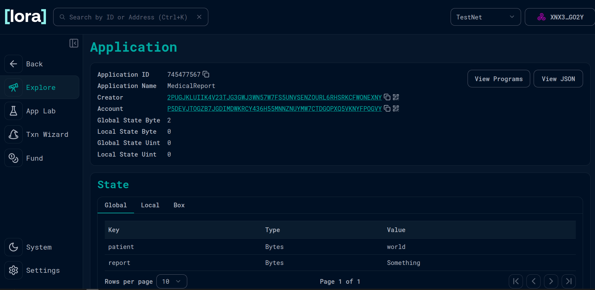

🩺 Medical Report Smart Contract

contract address:https://lora.algokit.io/testnet/application/745477567

This project implements a simple Algorand smart contract in TypeScript that manages medical reports on-chain. It demonstrates how to use global state in Algorand smart contracts for securely storing and updating key information.

✨ Features

Stores a patient’s name in contract global state.

Stores a medical report associated with that patient.

Provides a function to issue a new report that updates both values.

Returns a confirmation string upon successful report issuance.

📜 Contract Overview

The smart contract is defined in MedicalReport.ts and extends the Contract class from @algorandfoundation/algorand-typescript
.

Global State Variables

patient: Holds the patient’s name (string).

report: Holds the medical report text (string).

Methods

issueReport(name: string, rep: string): string
Updates the contract’s global state with a patient name and their medical report, then returns a success message.

Example:

const response = contract.issueReport("Alice", "Patient is healthy.");
// response: "Medical report issued for Alice"

🚀 Getting Started
Prerequisites

Node.js (v16+)

Yarn or npm

Algorand Sandbox or an Algorand node connection

Installation
git clone <your-repo-url>
cd medical-report-contract
npm install

Running the Contract

You can compile, deploy, and interact with the contract using the Algorand TypeScript SDK.
Example (pseudo-code):

import { MedicalReport } from "./MedicalReport"

const contract = new MedicalReport()

console.log(contract.issueReport("Bob", "Requires follow-up in 2 weeks."))

📂 Project Structure
├── MedicalReport.ts    # Smart contract definition
├── package.json        # Project metadata & dependencies
└── README.md           # Project documentation

🔮 Future Improvements

Add access control (only doctors can issue reports).

Allow multiple reports per patient instead of overwriting.

Add transaction-based interaction instead of simple function calls